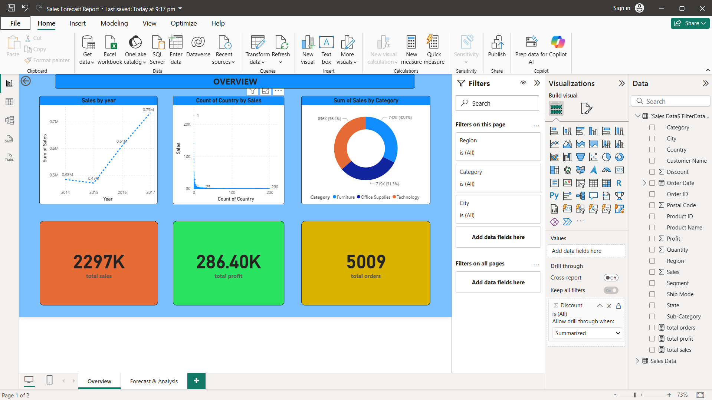
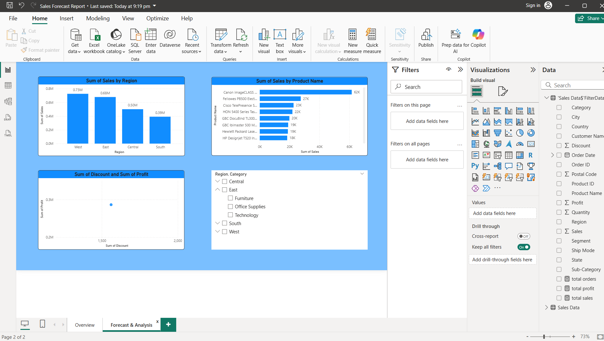
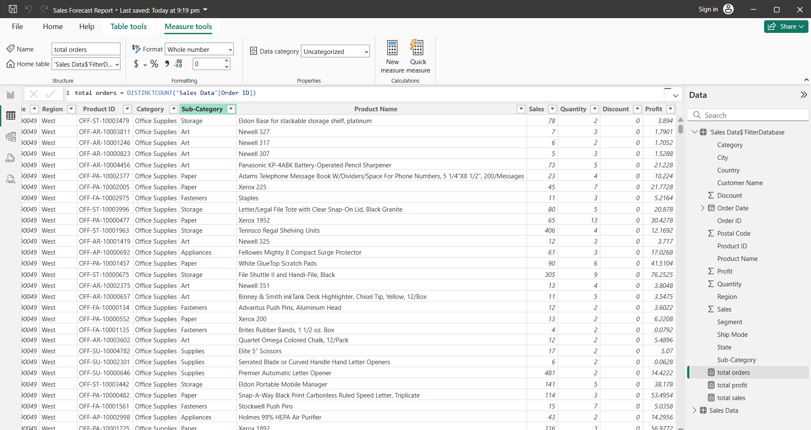

# Sales Forecast Report (Power BI)

## Project Overview
This Power BI project provides an interactive sales forecast dashboard that helps visualize and analyze business performance trends.  
It includes KPIs, regional performance, category-wise sales breakdowns, and future sales predictions based on historical data.

---

## Objectives
- Analyze sales performance over time.
- Forecast future sales trends using Power BI’s analytics and AI visuals.
- Provide actionable insights for data-driven decision-making.
- Visualize key metrics like:
  - Total Sales
  - Profit Margin
  - Regional Sales
  - Forecasted Revenue

---

## Features
- Dynamic slicers and filters for real-time analysis.
- Forecasting visuals using Power BI analytics tools.
- Clean and interactive dashboard layout.
- Automatically updates with new data (if connected to a data source).

---

## Tools and Technologies
- Microsoft Power BI
- Excel / CSV data source
- DAX (Data Analysis Expressions)
- Power Query for data transformation

---

## How to Use
1. Download the `.pbix` file:
   ```
   Sales Forecast Report.pbix
   ```
2. Open it using Power BI Desktop.
3. Explore the dashboard, apply filters, and analyze insights.
4. (Optional) Connect your own dataset to customize the visuals.

---

## Dashboard Preview
(Added a screenshot of  Power BI dashboard here)  
Example:  
[](https://github.com/janaranjan-ai/POWER-BI-PROJECTS/blob/main/SALES%20FORECAST%20REPORT/IMAGES/Overview.png)
[]
[](https://github.com/janaranjan-ai/POWER-BI-PROJECTS/blob/main/SALES%20FORECAST%20REPORT/IMAGES/Datasetpic.png)

---

## Contact
If you have questions or suggestions, feel free to reach out:
- Author: Janaranjan K
- Email: kjanaranjan5607@gmail.com
- GitHub: [@janaranjan-ai](https://github.com/janaranjan-ai)

---

If you like this project, give it a star on GitHub!
